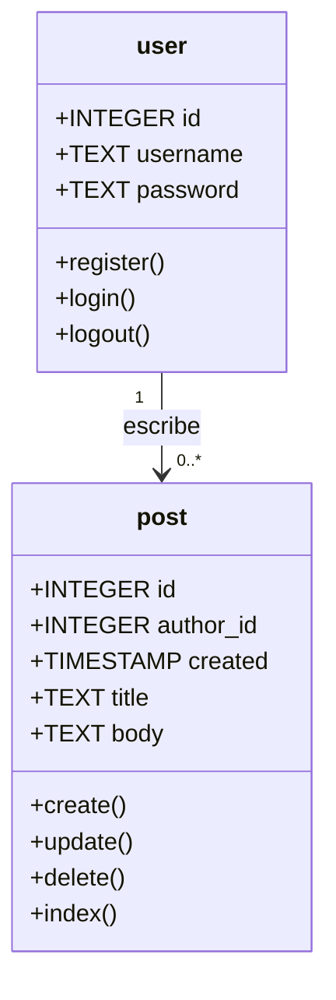

# Diagrama de clases de Flaskr

Este diagrama muestra las clases principales del blog, sus atributos, métodos y la relación entre usuarios y publicaciones.

```mermaid
classDiagram
    class user {
        +INTEGER id
        +TEXT username
        +TEXT password
        +register()
        +login()
        +logout()
    }

    class post {
        +INTEGER id
        +INTEGER author_id
        +TIMESTAMP created
        +TEXT title
        +TEXT body
        +create()
        +update()
        +delete()
        +index()
    }

    user "1" --> "0..*" post : escribe
```
